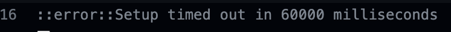

# 課題について

今回は追加の課題はありません。
先ほどの「セッションを体験してみよう①、②」をpushすれば基本OKです。

## 課題の合格基準について

- `session4.php`にて、セッションに保存した値、名前:`user_name`, 職業:`job` を取得し画面に表示できること
- `session5.php`にて、セッションに保存した値、年齢:`age`を取得し画面に表示できること
- `session7.php`にて、`session5.php`にて破棄したセッションIDが、新しく作られていることが確認できること

## 合格確認方法

1. pushし、課題を提出する
2. 再度[本章リモートリポジトリ](https://classroom.github.com/a/CKQpGriB)にアクセスする 
3. 画面上部にある`Actions`をクリック 

1. **一番上**の行に、緑色のチェックが入っていればOK 

## エラーが出た時の対処法

自動採点がエラーになると、**一番上**の行に赤いばつ印がでます。その場合の解決策を以下に示します。

## タイムアウトになっていないかを確認する

※右端の赤枠で囲まれている箇所に処理時間がでますが、**4分前後**かかっている場合には、まずタイムアウトの可能性を疑ってください。

具体的なタイムアウトの確認・解決方法は、

  1. `Actions`のタイトルが以下のようにリンクになっているので、クリック
      
  2. `run-autograding-tests.png`をクリック
   
  3. 赤いばつ印が出ている箇所をクリック
  
  1. `::error::Setup timed out in XXXXXX milliseconds`のメッセージがあればタイムアウト
   
  6. 解決策としては、右上に`Re-run jobs`(再実行)のボタンがあるので、`Re-run failed jobs`(失敗した処理だけ再実行)をクリックする。
   
  
  7. タイムアウトにならず3分以内に処理が終了したらOK。※タイムアウトでないエラーは、次の解決策を参照。

## プログラムが正確に書かれているか確認する

プログラムが正確に書かれているかを確認してください。
たとえ、ブラウザの画面でそれらしく表示されても、自動採点なので融通は効きません。
