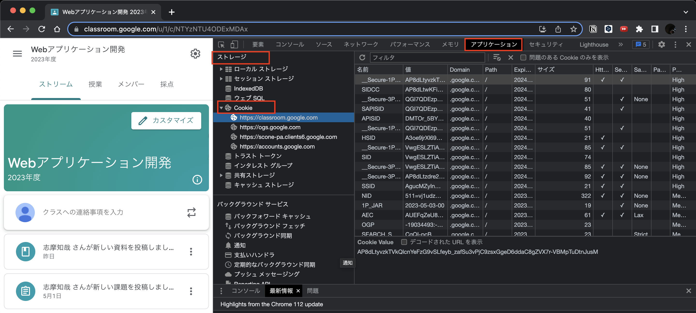
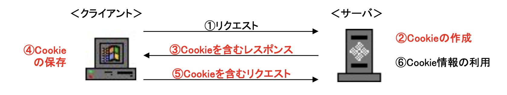

# Cookieとは

Webサーバーが、Webブラウザを通じてユーザーのコンピュータに一時的にデータを書き込んで保存する仕組みです。
Netscape Communications社が同社のブラウザにCookieを組み込んだのが始まりです。(1994年)

Cookieは、主にユーザに関する情報や最後にサイトを訪れた日時、そのサイトの訪問回数などを記録し、ユーザーの識別に使われます。
具体的には、認証システムや、Webによるサービスをユーザごとにカスタマイズするパーソナライズシステムの要素技術として利用されています。

本来、サーバサイド技術においては、サーバからクライアント側に対して書き込みを行うことは許されません。 
→**データを書き込むことは、対象の端末を操作する**ということだからです。

ChromeやFirefoxのブラウザで「F12」キーをクリックすると「デベロッパーツール」が表示されるので、Cookieの値を確認することができます。

Chromeの場合だと、以下の手順で確認できます。
1. 「F12」キーでデベロッパーツールを開く
2. デベロッパーツールの「アプリケーション」タブを選択する
3. 「ストレージ」のセクションにある「Cookies」アイコンを開く

以降の章で出てくる「ログイン認証」の章でCookieを利用しますので、まずは本章で仕組みを理解しておきましょう。

## Cookieの基本仕様

HTTPレスポンス・メッセージの「Set-Cookie:」ヘッダーで発行するCookie情報を送信します。
Webアプリケーション上におけるCookieについての流れは以下のイラストのとおりです。

 

発行するCookieには、「名前(Cookie名)とその値」、「有効期限」「適用範囲（ドメイン名とパス名）」などが記述されています。

- 名前(Cookie名)とその値 **※必須** 
Cookie名は、Webサーバ側で決定し、名前を変えて複数のCookieを発行することができます。
値はCookieそのものを表し、この値でユーザーを識別します。

- 有効期限 **※任意**
  - 固定Cookie
    - 有効期限がセットされている場合、そのCookieをハードディスクに保存します。
  - セッションCookie
    - 有効期限がセットされていない場合、パソコン内のメモリーにだけ保持し、Webブラウザを閉じると同時に消えます。

- 適用範囲 **※任意** 
Cookieの適用範囲とは、WebブラウザがCookieを送り返すWebサーバーを指し、ドメイン名とパス名で表します。  
例えばWebサーバーから、`domain=sample.com; path＝/auth` といった適用範囲のCookieが発行された場合、「sample.com」の「/auth」ディレクトリ以下にアクセスする場合のみCookieを送ります。
同じ「sample.com」のサイトでも、他のディレクトリへアクセスする場合には送りません。  
Webサーバーのドメイン名と異なるドメイン名を適用範囲とするCookieは無効と判断し、Cookieはブラウザに保存されません。
適用範囲の情報がセットされていなかった場合、ソースコードと同じパスが自動で設定されます。