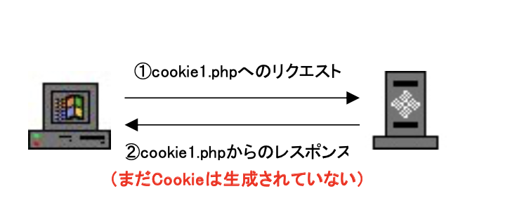
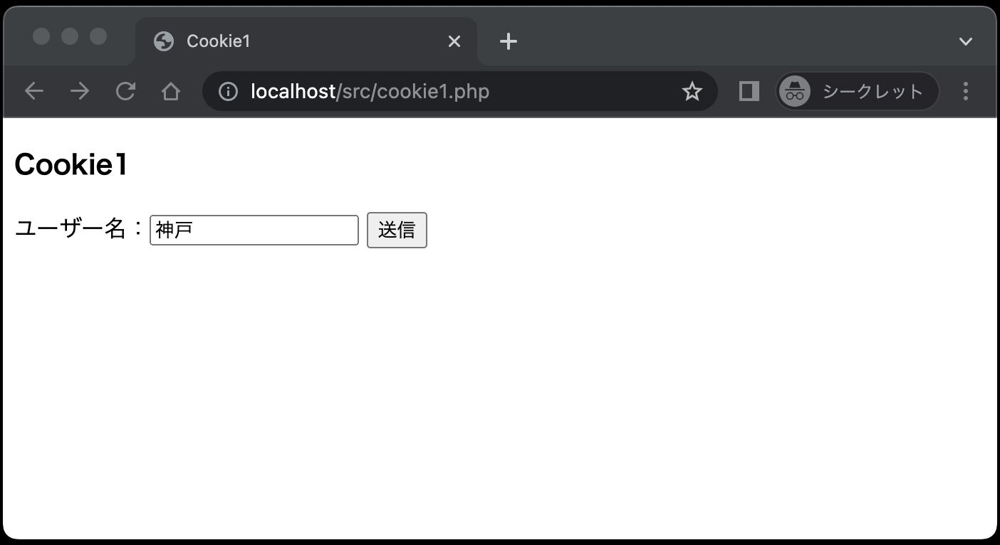
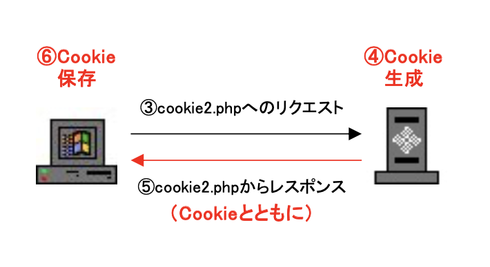
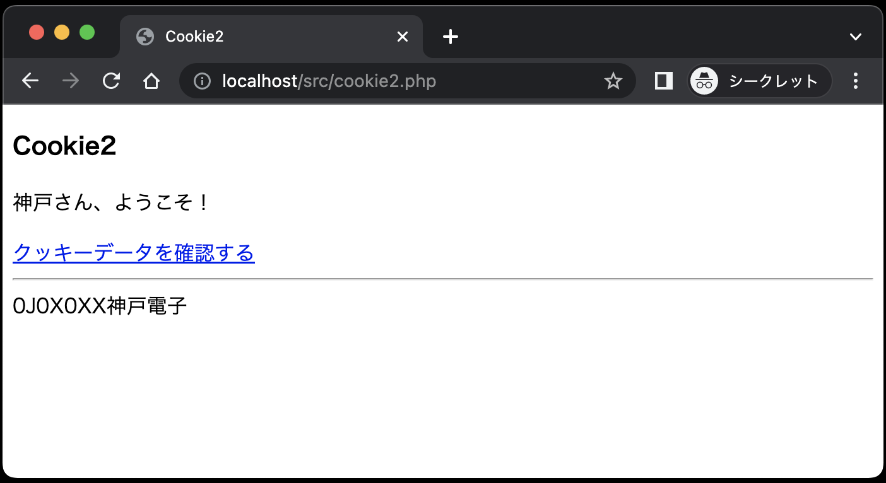
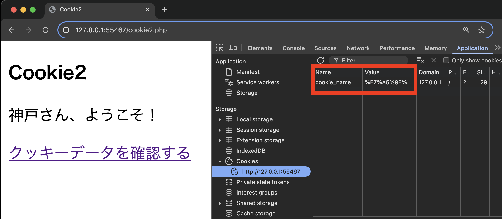

# Cookieを体験してみよう

`public`ディレクトリに、`cookie1.php`、`cookie2.php`、`cookie3.php`、`cookie4.php`を作成してください。

## サーバからCookieを生成する

まずは、サーバにリクエストを送信して、Cookieを生成する流れを`cookie1.php`、`cookie2.php`で体験してみましょう。

### ◆cookie1

ブラウザ（クライアント）からApacheサーバに `cookie1.php` へのリクエストを送信します。
Apacheサーバは `cookie1.php` のHTMLをレスポンスしますが、この時点ではまだCookieは生成されていません。
イラストで表すと以下のようになります。<br>
<br><br>
ブラウザは、`cookie1.php` の内容を画面に表示します。（下図はユーザー名「神戸」を入力した状態）<br>
<br><br>

`cookie1.php`

```php
<!DOCTYPE html>
<html lang="ja">

<head>
  <meta charset="UTF-8">
  <meta name="viewport" content="width=device-width, initial-scale=1.0">
  <title>Cookie1</title>
</head>

<body>
  <h3>Cookie1</h3>
  <form method="POST" action="cookie2.php">
    ユーザー名：<input type="text" name="user_name">
    <input type="submit" value="送信">
  </form>
</body>

</html>
```

この画面で、ユーザー名に「神戸」と入力し、送信ボタンを押すと、`cookie2.php`にデータが送信されます。

### ◆cookie2

`cookie2.php` は、受信した「ユーザー名」の値（神戸）をもとにクッキー名`cookie_name` でCookieを生成します。
そして、「神戸さん、ようこそ！」のHTMLとともに、生成したCookieをクライアントにレスポンスします。

ブラウザは、送信されてきたCookieを保存し、`cookie2.php` の内容を画面に表示します。イラストと画面表示は次のようになります。
<br><br>
<br><br>
「クッキーデータを確認する」リンクをクリックすると、保存したCookieデータとともに `cookie3.php` へのリクエストをApacheサーバに送信します。（保存したデータとは、クッキー名：cookie_name、値：神戸の組み合わせ）<br><br>

`cookie2.php`

```php
<?php
if (isset($_POST['user_name'])  &&  $_POST['user_name']  !=  '') { // ① 
  $user_name  =  $_POST['user_name']; // ②
  setcookie('cookie_name',  $user_name,  time() + 10, '/'); // ③
}
?>

<!DOCTYPE html>
<html lang="ja">

<head>
  <meta charset="UTF-8">
  <meta name="viewport" content="width=device-width, initial-scale=1.0">
  <title>Cookie2</title>
</head>

<body>
  <h3>Cookie2</h3>
  <?php
  if (isset($user_name)) {
    echo '<p>' . $user_name . 'さん、ようこそ！</p>';
    echo '<a href="cookie3.php">クッキーデータを確認する</a>';
  } else {
    echo '<p>名前が入力されていません。</p>';
    echo '<a href="cookie1.php">cookie1.phpに戻る</a>';
  }
  ?>
</body>

</html>
```

**【解説】**

①: `if(isset($_POST['user_name'])  &&  $_POST['user_name']  !=  '') {`<br>
パラメータ名 `user_name` でデータが送られてきていることを確認しています。<br>

- `isset($_POST['user_name'])`
  - PHPの `isset( )` 関数で、 `$_POST['user_name']` の値があれば `True` を返します。
- `$_POST['user_name'] != ''`
  - `$_POST['user_name']` の値が「空文字」でなければ `True` を返します。

②: `$user_name = $_POST['user_name'];`<br>
パラメータ名 `user_name` で送られてきた値を取得しています。

③: `setcookie('cookie_name', $user_name, time( ) + 10, '/');`<br>
送られてきた値をクッキー名 `cookie_name` で保存するクッキーデータを用意します。
このとき、第3引数の `time( ) + 10` でクッキーの有効期限を設定しています。

`time( )` 関数は、PHPで定義されている関数で、現在時刻をUnixエポック(1970年1月1日 00:00:00 GMT)からの 通算秒 として返す関数で、`time( ) + 10` で現在時刻から10秒間だけ有効なクッキーとしています。
以下はもう少し複雑な例です。

- 有効期限を現在時刻から3日間とする場合

  ```php
  time( ) + 60 * 60 * 24 * 3
  // ※60(秒) * 60(分) * 24(時間) * 3(日) = 259,200(秒)
  ```

有効期限を指定しない場合は、**クライアント側のブラウザが閉じられると消えてしまう**クッキーとなります。

この時点で、生成されたCookieは、ブラウザに保存されるので、ブラウザの「F12」キーを押してデベロッパーツールを開き、「アプリケーション」タブの「Cookies」を選択すると、以下のように表示されます。
生成されたCookieの値が日本語の場合は、添付画像のようにブラウザでエンコードされて表示されます。

<br><br>

## 生成されたCookieを受け取り、破棄する


### ◆cookie3

`cookie3.php` は、Cookieデータを取得したのち、Cookieデータを破棄するデータとともにレスポンスを返します。
イラストと画面表示は以下のようになります。

<br><br>
<br><br>

「破棄後のクッキーデータを確認する」リンクをクリックすると、`cookie4.php` へのリクエストをApacheサーバに送信します。このとき、クッキーデータは破棄されているので、送信されません。

`cookie3.php`

```php
<?php
if (isset($_COOKIE['cookie_name'])) { // ①
  $cookie_name = $_COOKIE['cookie_name'];
  setcookie('cookie_name', '', time() - 10, '/'); // ②
}
?>

<!DOCTYPE html>
<html lang="ja">

<head>
  <meta charset="UTF-8">
  <meta name="viewport" content="width=device-width, initial-scale=1.0">
  <title>Cookie3</title>
</head>

<body>
  <h3>Cookie3</h3>
  <?php
  if (isset($cookie_name)) {
    echo '<p>Cookieに保存されている名前は「' . $cookie_name . '」ですが、ここで破棄します。</p>';
    echo '<a href="cookie4.php">破棄後のクッキーデータを確認する</a>';
  } else {
    echo '<p>Cookieデータが保存されていません。</p>';
    echo '<a href="cookie1.php">cookie1.phpに戻る</a>';
  }
  ?>
</body>

</html>
```

**【解説】**

①: `$_COOKIE['cookie_name']`<br>
`$_COOKIE[ ]` は連想配列。（`$_GET[ ]` や `$_POST[ ]` も連想配列）<br>
②: `setcookie("cookie_name", '', time( ) - 10, '/');`<br>
クッキーを破棄するには、有効期限を昔の時間に設定します。<br>
ここでは、現在時刻から10秒前の時間を設定しています。

ちなみに、`cookie2.php` でCookieの有効期限を `time( ) + 10`で10秒間に設定しましたが、10秒以上経過した後、`cookie2.php` から `cookie3.php` にアクセスすると、Cookieが保存されていないので以下のような画面になります。

<br>

### cookie4

クッキーデータは送信されてこないので、`cookie4.php` がクッキーデータを取得しようとすると、そのようなデータがないという注意メッセージが表示されます。

<br><br>
<br>

**エラーメッセージの意味（要約）**

未定義の配列キーである `cookie_name` が `cookie4.php` の X行目(on line X)に書かれています。

`cookie4.php`

```php
<!DOCTYPE html>
<html lang="ja">

<head>
    <meta charset="UTF-8">
    <meta name="viewport" content="width=device-width, initial-scale=1.0">
    <title>Cookie4</title>
</head>

<body>
    <h3>Cookie4</h3>
    <?php
    echo $_COOKIE['cookie_name'];
    echo '<p>Cookieデータが破棄されているので、$_COOKIE["cookie_name"]の値は取得できません。</p>';
    echo '<a href="cookie1.php">cookie1.phpに戻る</a>';
    ?>
</body>

</html>
```

`echo $_COOKIE['cookie_name'];`<br>
クッキー名`cookie_name`の値を画面に表示しようとしていますが、すでに破棄されているため、値を取得できない旨のメッセージが表示されます。

**本章の「Cookie」では課題の提出はございません。課題提出は次章「セッション」で行います。**<br>
次章「セッション管理」で、本章のCookieと組み合わせることで、**ステートフル**な通信を持つWebアプリケーションを実装していきます！(※HTTP通信は元々、「ステート**レス**」な通信でしたね。)

お楽しみに！