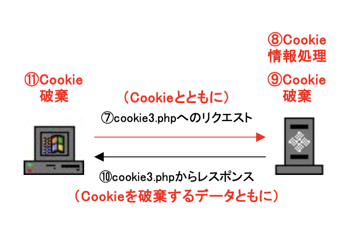
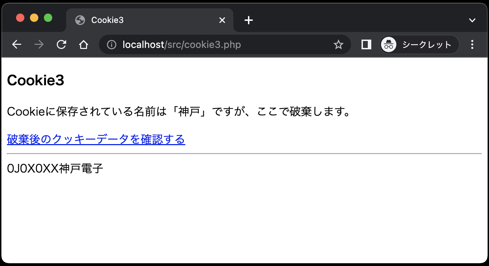
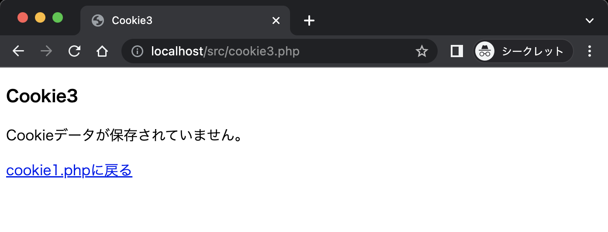
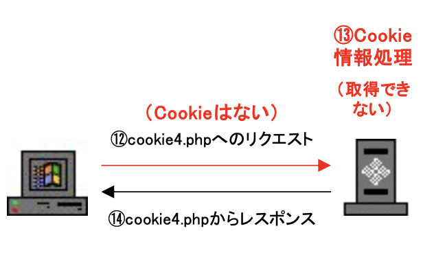
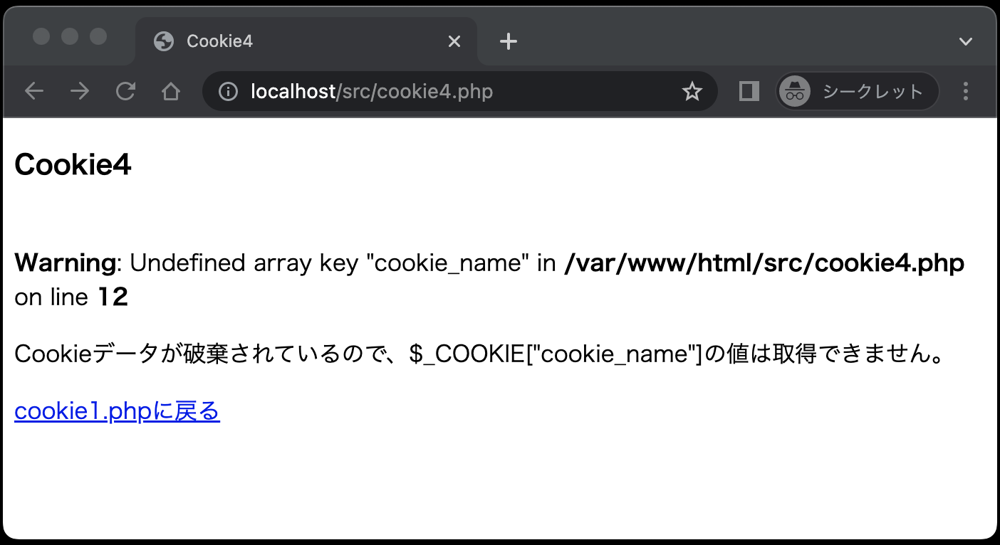

# Cookieを体験してみよう②

## ブラウザのCookieをサーバで受け取り、サーバにて破棄する

次に、ブラウザに保存されたCookieをサーバで受け取り、破棄する流れを `cookie3.php`、`cookie4.php` で体験してみましょう。

### ◆cookie3

`cookie3.php` は、Cookieデータを取得したのち、Cookieデータを破棄するデータとともにレスポンスを返します。
イラストと画面表示は以下のようになります。

<br><br>
<br><br>

「破棄後のクッキーデータを確認する」リンクをクリックすると、`cookie4.php` へのリクエストをApacheサーバに送信します。
このとき、クッキーデータは破棄されているので、送信されません。

**cookie3.php**

```php
<?php
if (isset($_COOKIE['cookie_name'])) { // ①
  $cookie_name = $_COOKIE['cookie_name'];
  setcookie('cookie_name', '', time() - 10, '/'); // ②
}
?>

<!DOCTYPE html>
<html lang="ja">

<head>
  <meta charset="UTF-8">
  <meta name="viewport" content="width=device-width, initial-scale=1.0">
  <title>Cookie3</title>
</head>

<body>
  <h3>Cookie3</h3>
  <?php
  if (isset($cookie_name)) {
    echo '<p>Cookieに保存されている名前は「' . $cookie_name . '」ですが、ここで破棄します。</p>';
    echo '<a href="cookie4.php">破棄後のクッキーデータを確認する</a>';
  } else {
    echo '<p>Cookieデータが保存されていません。</p>';
    echo '<a href="cookie1.php">cookie1.phpに戻る</a>';
  }
  ?>
</body>

</html>
```

**【解説】**

①: `$_COOKIE['cookie_name']`<br>
`$_COOKIE[ ]` は連想配列。（`$_GET[ ]` や `$_POST[ ]` も連想配列）<br>
②: `setcookie("cookie_name", '', time( ) - 10, '/');`<br>
クッキーを破棄するには、有効期限を昔の時間に設定します。<br>
ここでは、現在時刻から10秒前の時間を設定しています。

ちなみに、`cookie2.php` でCookieの有効期限を `time( ) + 10`で10秒間に設定しましたが、10秒以上経過した後、`cookie2.php` から `cookie3.php` にアクセスすると、Cookieが保存されていないので以下のような画面になります。

<br>

### ◆cookie4

クッキーデータは送信されてこないので、`cookie4.php` がクッキーデータを取得しようとすると、そのようなデータがないという注意メッセージが表示されます。

<br><br>
<br>

**エラーメッセージの意味（要約）**

未定義の配列キーである `cookie_name` が `cookie4.php` の X行目(on line X)に書かれています。

**cookie4.php**

```php
<!DOCTYPE html>
<html lang="ja">

<head>
    <meta charset="UTF-8">
    <meta name="viewport" content="width=device-width, initial-scale=1.0">
    <title>Cookie4</title>
</head>

<body>
    <h3>Cookie4</h3>
    <?php
    echo $_COOKIE['cookie_name'];
    echo '<p>Cookieデータが破棄されているので、$_COOKIE["cookie_name"]の値は取得できません。</p>';
    echo '<a href="cookie1.php">cookie1.phpに戻る</a>';
    ?>
</body>

</html>
```

**【解説】**

`echo $_COOKIE['cookie_name'];`<br>
クッキー名`cookie_name`の値を画面に表示しようとしていますが、すでに破棄されているため、値を取得できない旨のメッセージが表示されます。
