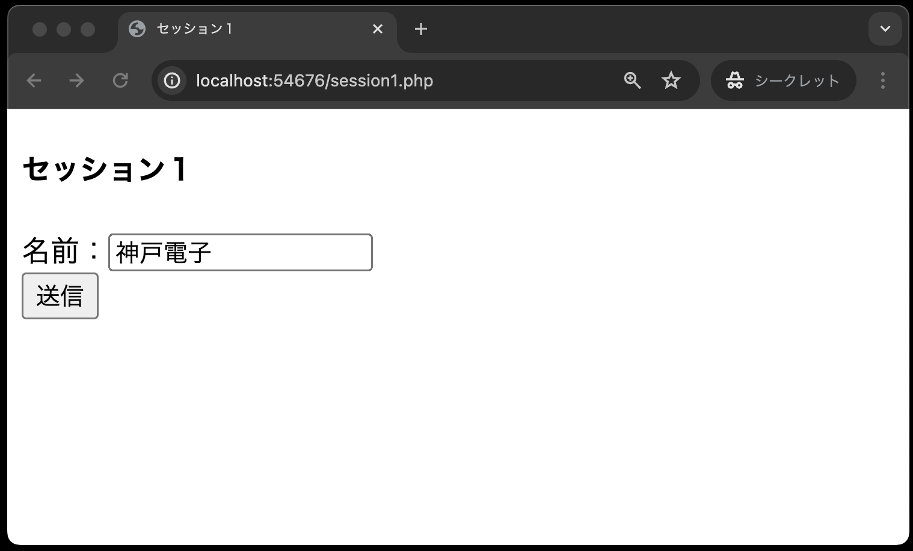
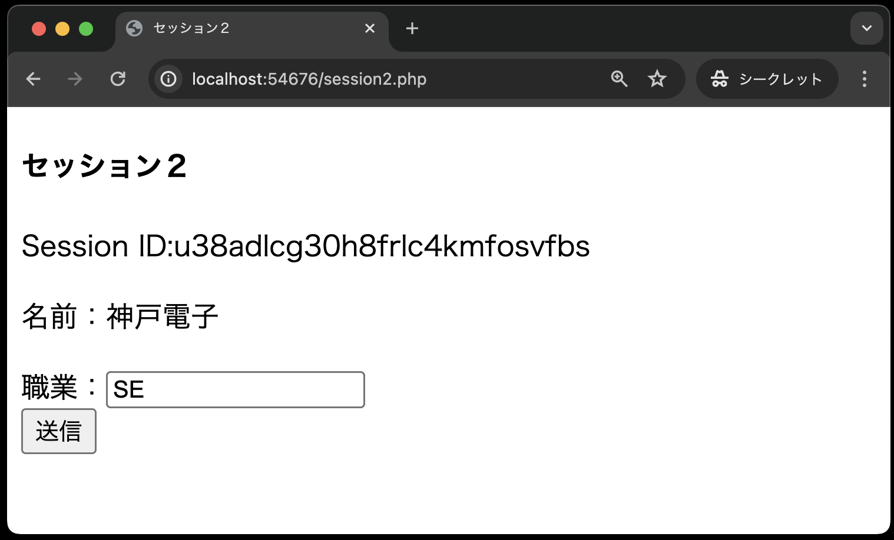
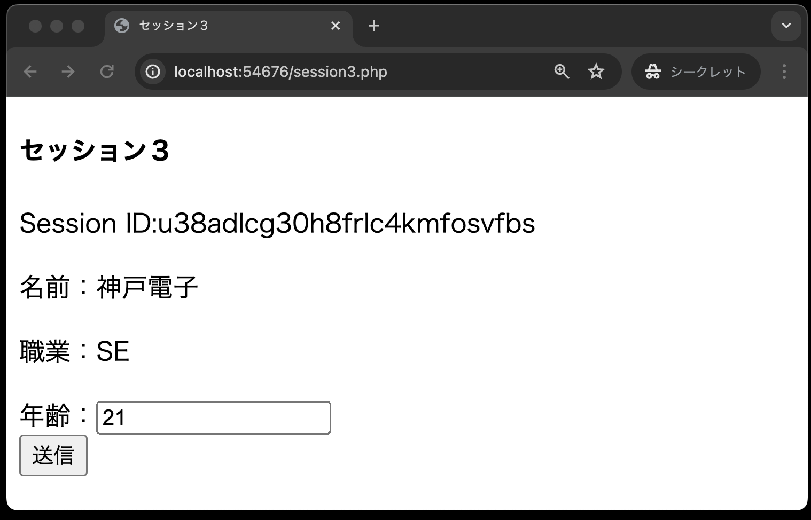
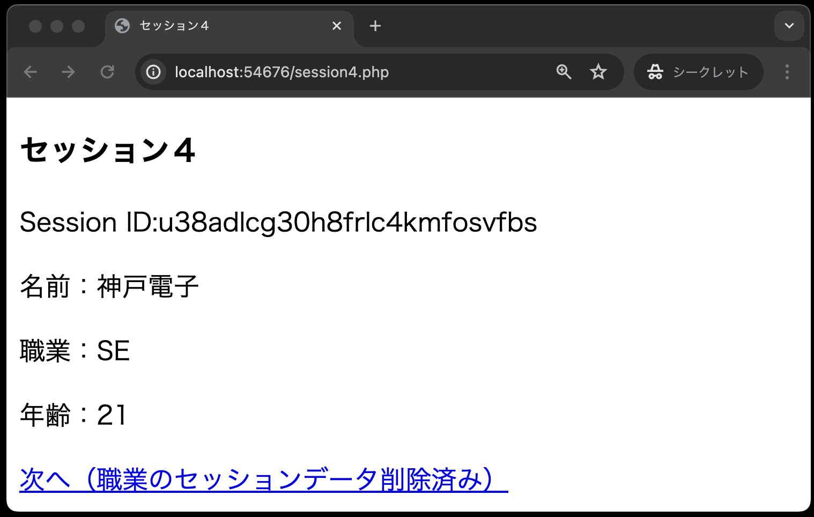
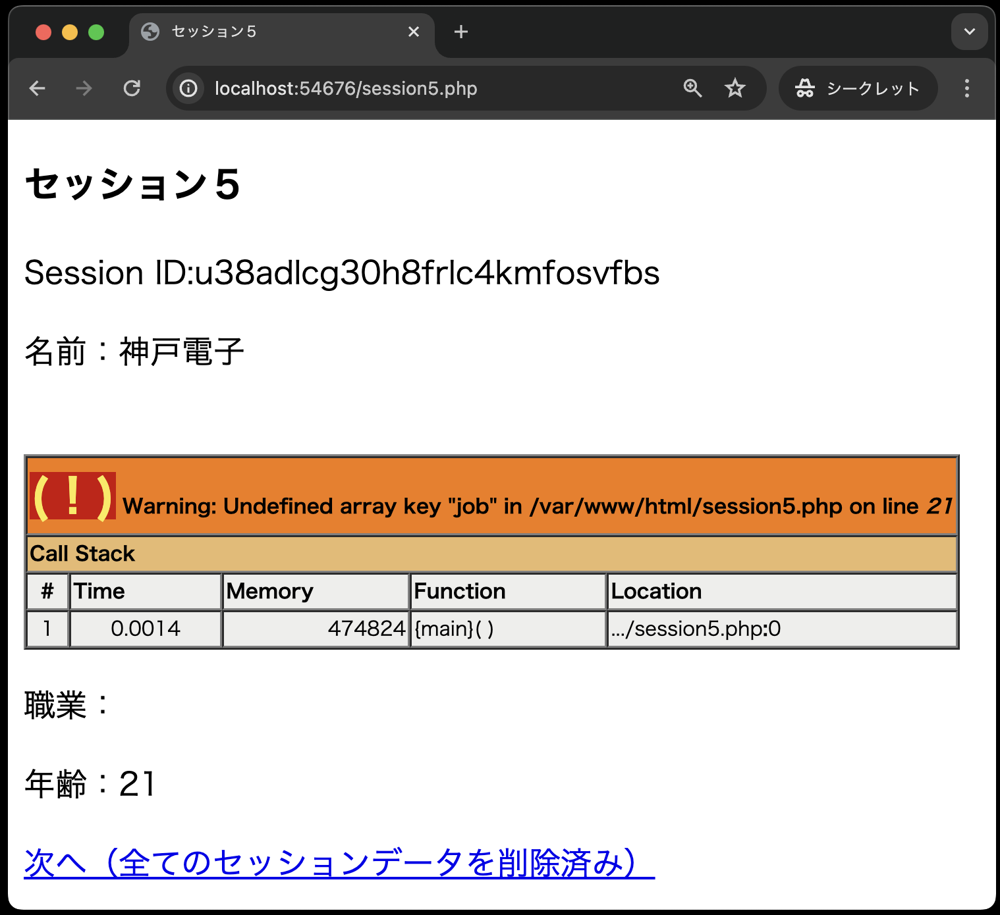

# Cookieとセッション管理

[こちらのページ]()から、ソースコードを`C:¥web_app_dev`へcloneしてください。

# セッション管理

## ステート（状態）とセッションの概要

プロトコルのステート(状態)とは、前後の伝送間で「情報※を覚えておく」能力のことです。

※情報・・・アクセスしているのは誰か、認証済みか、直前にはどんなリクエストがあったのか、等。

HTTPは「ステート**レス**」なプロトコルです。<br>
→ 「情報」を覚えておく能力がない

Webアプリケーションでのクライアントとサーバ間でのやり取りは、「ステートフル」(情報を覚えておく能力がある)でなければなりません。<br>
→ **「セッション」** を利用して、ステートレスなHTTPをステートフルなWebアプリケーションに変身させましょう。<br>
Webサーバーが作成した「セッションID」をクライアント（ブラウザ）側でクッキーを利用して保存し、ステートフルなやり取りができるようにします。

具体的には、ユーザーがログインした状態を保持したり、ショッピングサイトのカート機能の実装などで使われます。

デフォルトではステートレスなので以下のようになります。<br>


 セッションを利用してステートフルだと、以下のようになる。<br>

- サーバーが「セッションID」をクライアントに送る
- クライアントはそれを「クッキー」で保存する
<br>


## サンプル

今回のサンプルでは次のことを学びます。

1. セッションを開始する方法
2. セッションIDの値を取得する方法
3. セッションに値を保存する方法
4. セッションに保存した値を取り出す方法
5. セッションに保存している特定の値を破棄する方法
6. セッションに保存している全ての値を破棄する方法

### session1.php

名前を入力し、`session2.php`にリクエストを送信します。



```php
<?php
session_start();
?>

<!DOCTYPE html>
<html lang="ja">

<head>
  <meta charset="UTF-8">
  <meta name="viewport" content="width=device-width, initial-scale=1.0">
  <title>セッション１</title>
</head>

<body>
  <h4>セッション１</h4>
  <form method="POST" action="session2.php">
    名前：<input type="text" name="user_name"><br>
    <input type="submit" value="送信">
  </form>
</body>

</html>
```

`session_start( );`<br>
セッションを開始する場合、session_start( )関数を実行しなければなりません。セッション管理を行うPHPファイルすべてに記述が必要です。

### session2.php(セッション開始、セッションIDの取得、セッションに値を保存)

受け取った名前を画面に表示すると共に、セッションに保存します。
職業を入力し、`session3.php`に送信します。



```php
<?php
session_start(); // ①
?>

<!DOCTYPE html>
<html lang="ja">

<head>
  <meta charset="UTF-8">
  <meta name="viewport" content="width=device-width, initial-scale=1.0">
  <title>セッション２</title>
</head>

<body>
  <h4>セッション２</h4>
  <?php
  echo '<p>Session ID:' . $_COOKIE['PHPSESSID'] . '</p>'; // ②
  $_SESSION['name'] = $_POST['user_name']; // ③
  echo '<p>名前：' . $_POST['user_name'] . '</p>';
  ?>
  <form method="POST" action="session3.php">
    職業：<input type="text" name="job"><br>
    <input type="submit" value="送信">
  </form>
</body>

</html>
```

①`session_start( );` セッションを開始します。

②`echo '<p>Session ID：' . $_COOKIE['PHPSESSID'] . '</p>';`<br>
セッションを開始すると、クライアント側にセッションIDがクッキーとして書き込まれます。
クッキー名は `PHPSESSID`と決められています。（PHPのセッションIDという意味）

③`$_SESSION['name'] = $_POST['user_name'];`<br>
セッションに値を保存するには、PHPで定義済みの変数 `$_SESSION`（実態は連想配列）を使います。
送られてきた名前データを受け取り、`name` というセッション変数（キー）でセッションに保存しています。

### session3.php(セッションに保存した値を取得)

セッションから名前を取り出して表示し、受け取った職業を画面に表示するとともにセッションに保存します。
年齢を入力し、`session4.php`に送信します。



```php
<?php
session_start();
?>

<!DOCTYPE html>
<html lang="ja">

<head>
  <meta charset="UTF-8">
  <meta name="viewport" content="width=device-width, initial-scale=1.0">
  <title>セッション３</title>
</head>

<body>
  <h4>セッション３</h4>
  <?php
  echo '<p>Session ID:' . $_COOKIE['PHPSESSID'] . '</p>';
  echo '<p>名前：' . $_SESSION['name'] . '</p>'; // ①
  $_SESSION['job'] = $_POST['job']; // ②
  echo '<p>職業：' . $_POST['job'] . '</p>';
  ?>
  <form method="POST" action="session4.php">
    年齢：<input type="text" name="age"><br>
    <input type="submit" value="送信">
  </form>
</body>

</html>
```

①`echo '<p>名前：' . $_SESSION['name'] . '</p>';`<br>
セッションから名前のデータを取り出し、画面に表示しています。

②`$_SESSION['job'] = $_POST['job'];`<br>
送られてきた職業データを受け取り、「job」というセッション変数(キー)でセッションに保存しています。

### session4.php(セッションに保存した特定の値を破棄)

セッションから名前と職業を取り出して表示し、受け取った年齢を画面に表示するとともにセッションに保存します。
その後、職業のデータをセッションから削除します。



```php
<?php
session_start();
?>

<!DOCTYPE html>
<html lang="ja">

<head>
  <meta charset="UTF-8">
  <meta name="viewport" content="width=device-width, initial-scale=1.0">
  <title>セッション４</title>
</head>

<body>
  <h3>セッション４</h3>
  <?php
  echo '<p>Session ID:' . $_COOKIE['PHPSESSID'] . '</p>';
  echo '<p>名前：' . $_SESSION['name'] . '</p>';
  echo '<p>職業：' . $_SESSION['job'] . '</p>';
  unset($_SESSION['job']);
  $_SESSION['age'] = $_POST['age'];
  echo '<p>年齢：' . $_POST['age'] . '</p>';
  ?>
  <a href='session5.php'>次へ（職業のセッションデータ削除済み）</a>
</body>

</html>
```

`unset ( $_SESSION[ 'job' ] );`<br>
`unset( )`関数を使って、セッション変数(キー）をセッションから削除しています。<br>
【注意】`unset($_SESSION)`によって 全ての`$_SESSION`を初期化してはなりません。
そうしてしまうと、その後セッション変数の登録ができなくなってしまいます。

### session5.php(セッションに保存した全ての値を破棄)

職業のデータはセッションから削除されているため、エラーメッセージが表示されます。
セッションID、名前、年齢の情報を画面に表示した後、すべてのデータをセッションから削除すします。



```php
<?php
session_start();
session_destroy(); // ①
setcookie('PHPSESSID', '', time() - 10, '/'); // ②
?>

<!DOCTYPE html>
<html lang="ja">

<head>
  <meta charset="UTF-8">
  <meta name="viewport" content="width=device-width, initial-scale=1.0">
  <title>セッション５</title>
</head>

<body>
  <h3>セッション５</h3>
  <?php
  echo '<p>Session ID:' . $_COOKIE['PHPSESSID'] . '</p>';
  echo '<p>名前：' . $_SESSION['name'] . '</p>';
  echo '<p>職業：' . $_SESSION['job'] . '</p>'; // ③
  echo '<p>年齢：' . $_SESSION['age'] . '</p>';
  $oldsessid = $_COOKIE['PHPSESSID']; // ④
  echo '<a href="session6.php?oldsessid=' . $oldsessid . '">次へ（全てのセッションデータを削除済み）</a>'; // ⑤
  ?>
</body>

</html>
```

①`session_destroy ( );`<br>
セッション変数を全て削除する関数です。

②`setcookie('PHPSESSID', '', time( ) - 10,  '/');`<br>
`session_destroy ( );` でセッション変数を全て削除しても、それだけではセッションIDは削除されません。
クライアント側に保存されているセッションIDを削除するために、クッキーで保存されているセッションID（クッキー名：PHPSESSID）を削除しています。

なお、セッションクッキーは `session_start( )` 関数を実行した際に作成されますが、このときに session.cookie_pathの値（デフォルトは「/」）を付けてクッキーが作られます。
このため、セッションクッキーを削除するときは明示的にパスを指定しなければなりません。
そのために、第4引数の「'/'」でデフォルトのパスを指定しています。
もし、この第4引数のパスを指定しないと、セッションクッキーは削除されません。

③`echo '<p>職業：' . $_SESSION['job'] . '</p>';`

前のsession4.phpで「job」のセッション変数は削除されているためエラーメッセージが表示されます。

④`$oldsessid = $_COOKIE['PHPSESSID'];`<br>
⑤`echo '<a href="session6.php?oldsessid=' . $oldsessid . '">次へ（全てのセッションデータを削除済み）</a>'`

session7.phpで新しいセッションIDと比較するために、この時点でのセッションIDを取得し、クエリパラメータを用いて次のsession6.phpへセッションIDの値を送信しています。

### session6.php

全てのデータがセッションから削除されているため、エラーメッセージが表示される。
また、セッションIDも削除されたため、ここで新しいセッションを開始します。


```php
<?php
session_start();
?>
<!DOCTYPE html>
<html lang="ja">

<head>
  <meta charset="UTF-8">
  <meta name="viewport" content="width=device-width, initial-scale=1.0">
  <title>セッション６</title>
</head>

<body>
  <h3>セッション６</h3>
  <?php
  echo '<p>Session ID:' . $_COOKIE['PHPSESSID'] . '</p>'; // ①
  echo '<p>名前：' . $_SESSION['name'] . '</p>'; // ①
  echo '<p>職業：' . $_SESSION['job'] . '</p>'; // ①
  echo '<p>年齢：' . $_SESSION['age'] . '</p>'; // ①
  $oldsessid = $_GET['oldsessid']; // ②
  echo '<a href="session7.php?oldsessid=' . $oldsessid . '">新しいセッション開始</a>'; // ②
  ?>
</body>

</html>
```

①セッションIDをはじめ、すべてのセッション変数が削除されているので、いずれもエラーメッセージが表示されます。

②新しいセッションが開始され、次のsession7.phpで前のセッションIDと値を比較します。
前のセッションIDは、クエリパラメータで送られてくるので`$_GET[ ]`で値を取得します。
また、session7.phpで新しいセッションIDと比較するために、クエリパラメータをセッションIDの値を送信します。

### session7.php

新しいセッションが開始されているので、前のセッションとセッションIDの値が異なります。


```php
<?php
session_start();
?>

<!DOCTYPE html>
<html lang="ja">

<head>
  <meta charset="UTF-8">
  <meta name="viewport" content="width=device-width, initial-scale=1.0">
  <title>セッション７</title>
</head>

<body>
  <h3>セッション７</h3>
  <?php
  echo '<p>Old Session ID：' . $_GET['oldsessid'] . '</p>'; // ①
  echo '<p>New Session ID：' . $_COOKIE['PHPSESSID'] . '</p>'; // ①
  ?>
  <a href="session1.php">最初に戻る</a>
</body>

</html>
```

①前のセッションID（Old Session ID）と新しいセッションID（New Session ID）の値が違うことを確認できます。 前のセッションID（Old Session ID）は、クエリパラメータで送られてくるので$_GET[ ]で値を取得します。

## 採点について

提出した課題がGitHub上で自動採点されます。pushした課題が合格したかはpush後に必ず確認してください。

### 課題の合格基準について

- `session4.php`にて、セッションに保存した値、名前:`user_name`, 職業:`job` を取得し画面に表示できること
- `session5.php`にて、セッションに保存した値、年齢:`age`を取得し画面に表示できること
- `session7.php`にて、`session5.php`にて破棄したセッションIDが、新しく作られていることが確認できること

### 合格確認方法

1. 本課題の[課題ページ](https://classroom.github.com/a/5mgEU8Ef)に再度アクセスしてください。
1. 画面上部にある`Actions`をしてください。<br>

1. **一番上**の行に、緑色のチェックが入っていればOKです。<br>


### エラーが出た時の対処法

自動採点がエラーになると、**一番上**の行に赤いばつ印がでます。その場合の解決策を以下に示します。

### タイムアウトになっていないかを確認する

右端の赤枠で囲まれている箇所に処理時間がでますが、**4分前後**かかっている場合には、まずタイムアウトの可能性を疑ってください。


  具体的なタイムアウトの確認・解決方法は、

  1. `Actions`のタイトルが以下のようにリンクになっているので、クリック
      
  2. `run-autograding-tests.png`をクリック
   
  3. 赤いばつ印が出ている箇所をクリック
  
  1. `::error::Setup timed out in XXXXXX milliseconds`のメッセージがあればタイムアウト
   
  6. 解決策としては、右上に`Re-run jobs`(再実行)のボタンがあるので、`Re-run failed jobs`(失敗した処理だけ再実行)をクリックする。
  <br>
  
  7. タイムアウトにならず2分以内に処理が終了したらOK。※タイムアウトでないエラーは、次の解決策を参照。

### プログラムが正確に書かれているか確認する

プログラムが正確に書かれているかを確認してください。たとえ、ブラウザの画面でそれらしく表示されても、自動採点なので融通は効きません。エラーが出た際は、以下の点を確認してください。

#### どこでエラーがでているか確認する

今回は3つの画面(session4.php, session5.php, session7.php)でそれぞれのテストがあるので、以下の手順でどこでエラーが出ているか確認してください。
※ただし、GitHub上でのエラーメッセージでは、原因の特定が難しい場合もあるので、ソースコードを見直しわからない場合は、適宜質問してください。

1. `Actions`のタイトルが以下のようにリンクになっているので、クリック
  　
2. `run-autograding-tests.png`をクリック
   
3. 以下のような3種類のテストの存在が確認できる
   - `TestSession4.py`: session4.phpに関するテスト
   - `TestSession5.py`: session5.phpに関するテスト
   - `TestSession7.py`: session7.phpに関するテスト
   
4. 各テストエラーがあった場合、それぞれのテストで以下のようにFAILEDと表示される。
   

