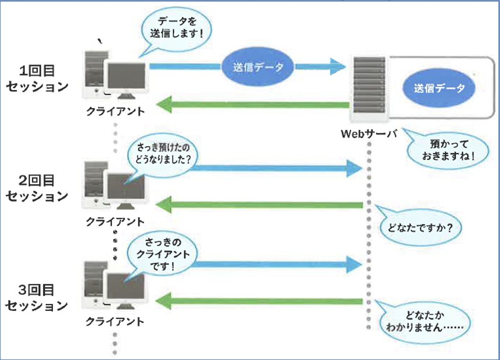
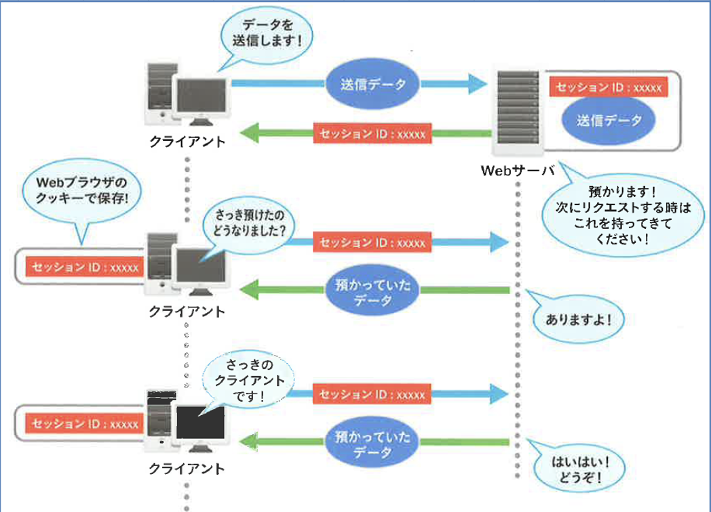

# セッション管理

## ステート（状態）とセッションの概要

「ステート(状態)」とは、通信において前後のやり取りの内容や文脈を保持する能力のことを指します。
具体的には、以下のような情報を保持します。

- アクセスしているのは誰か
- 認証済みかどうか
- 直前にどんなリクエストがあったか

以前、HTTPは**ステートレスなプロトコル**であると説明しました。
つまり、「前回の通信内容」を覚えておく仕組みが基本的にありません。

## Webアプリケーションにおける状態の管理

ユーザーのログイン状態やショッピングカートの中身など、ユーザーごとの状態を保持する必要がある場合、ステートレスなHTTPのままでは不十分です。
そこで、「セッション(session)」を使って、ステートを管理できる仕組みを導入します。

セッションの基本的な仕組みは以下の通りです。

1. サーバーがセッションIDを生成し、クライアントに送信
2. クライアントはこのセッションIDをクッキーとして保存
3. 以後の通信では、クッキーに含まれたセッションIDを使って、サーバーがユーザーを識別

このようにして、HTTPのステートレス性を補い、状態を保持する**ステートフル**な通信を実現します。

## 図解での比較

図を用いて、ステートレスとステートフルの違いを視覚的に理解しましょう。

デフォルト(ステートレス)の場合は、リクエストごとにユーザーの状態は保持されません。

一方、セッションを利用した場合は、クッキーによってユーザー状態が保持され、ステートフルな通信が可能になります。

