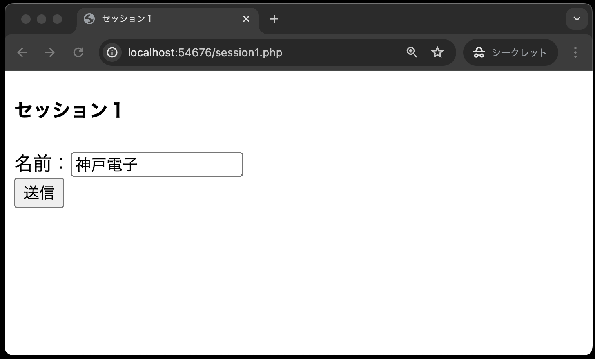

# セッションを体験してみよう①

今回のサンプルでは次のことを学びます。

1. セッションの開始
2. セッションIDの値を取得
3. セッションに値を保存
4. セッションに保存した値を取り出す
5. セッションに保存している特定の値を破棄
6. セッションに保存している全ての値を破棄

## ①セッションの開始(session1.php)

名前を入力し、`session2.php`にリクエストを送信します。



**session1.php**

```php
<?php
session_start();
?>

<!DOCTYPE html>
<html lang="ja">

<head>
  <meta charset="UTF-8">
  <meta name="viewport" content="width=device-width, initial-scale=1.0">
  <title>セッション１</title>
</head>

<body>
  <h4>セッション１</h4>
  <form method="POST" action="session2.php">
    名前：<input type="text" name="user_name"><br>
    <input type="submit" value="送信">
  </form>
</body>

</html>
```

**【解説】**

`session_start( );`<br>
セッションを開始する場合、`session_start( )`関数を実行しなければなりません。
なお、**セッション管理を行うPHPファイルすべてに記述が必要**です。

## ②セッションIDの取得、③セッションに値を保存(session2.php)

受け取った名前を画面に表示すると共に、セッションに保存します。
職業を入力し、`session3.php`に送信します。


**session2.php**

```php
<?php
session_start(); // ①
?>

<!DOCTYPE html>
<html lang="ja">

<head>
  <meta charset="UTF-8">
  <meta name="viewport" content="width=device-width, initial-scale=1.0">
  <title>セッション２</title>
</head>

<body>
  <h4>セッション２</h4>
  <?php
  echo '<p>Session ID:' . $_COOKIE['PHPSESSID'] . '</p>'; // ②
  $_SESSION['name'] = $_POST['user_name']; // ③
  echo '<p>名前：' . $_POST['user_name'] . '</p>';
  ?>
  <form method="POST" action="session3.php">
    職業：<input type="text" name="job"><br>
    <input type="submit" value="送信">
  </form>
</body>

</html>
```

①`session_start( );` セッションを開始します。先述しましたが、セッション管理を行うPHPファイルすべてに記述が必要です。

②`echo '<p>Session ID：' . $_COOKIE['PHPSESSID'] . '</p>';`<br>
セッションを開始すると、クライアント側にセッションIDがクッキーとして書き込まれます。
クッキー名は `PHPSESSID`と決められています。（PHPのセッションIDという意味）

③`$_SESSION['name'] = $_POST['user_name'];`<br>
セッションに値を保存するには、PHPで定義済みの変数 `$_SESSION`（実態は連想配列）を使います。
送られてきた名前データを受け取り、`name` というセッション変数（キー）でセッションに保存しています。

## ④セッションに保存した値を取得(session3.php)

セッションから名前を取り出して表示し、受け取った職業を画面に表示するとともにセッションに保存します。
年齢を入力し、`session4.php`に送信します。


**session3.php**

```php
<?php
session_start();
?>

<!DOCTYPE html>
<html lang="ja">

<head>
  <meta charset="UTF-8">
  <meta name="viewport" content="width=device-width, initial-scale=1.0">
  <title>セッション３</title>
</head>

<body>
  <h4>セッション３</h4>
  <?php
  echo '<p>Session ID:' . $_COOKIE['PHPSESSID'] . '</p>';
  echo '<p>名前：' . $_SESSION['name'] . '</p>'; // ①
  $_SESSION['job'] = $_POST['job']; // ②
  echo '<p>職業：' . $_POST['job'] . '</p>';
  ?>
  <form method="POST" action="session4.php">
    年齢：<input type="text" name="age"><br>
    <input type="submit" value="送信">
  </form>
</body>

</html>
```

①`echo '<p>名前：' . $_SESSION['name'] . '</p>';`<br>
セッションから名前のデータを取り出し、画面に表示しています。

②`$_SESSION['job'] = $_POST['job'];`<br>
送られてきた職業データを受け取り、「job」というセッション変数(キー)でセッションに保存しています。