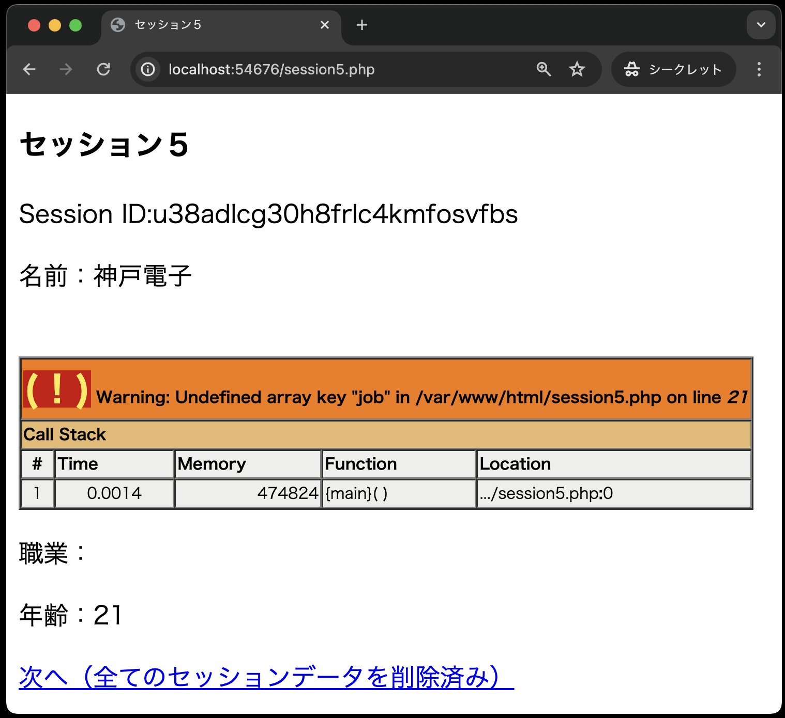

# セッションを体験してみよう②

今回のサンプルでは次のことを学びます。

1. セッションの開始
2. セッションIDの値を取得
3. セッションに値を保存
4. セッションに保存した値を取り出す
5. セッションに保存している特定の値を破棄
6. セッションに保存している全ての値を破棄

## ⑤セッションに保存した特定の値を破棄(session4.php)

セッションから名前と職業を取り出して表示し、受け取った年齢を画面に表示するとともにセッションに保存します。
その後、職業のデータをセッションから削除します。


**session4.php**

```php
<?php
session_start();
?>

<!DOCTYPE html>
<html lang="ja">

<head>
  <meta charset="UTF-8">
  <meta name="viewport" content="width=device-width, initial-scale=1.0">
  <title>セッション４</title>
</head>

<body>
  <h3>セッション４</h3>
  <?php
  echo '<p>Session ID:' . $_COOKIE['PHPSESSID'] . '</p>';
  echo '<p>名前：' . $_SESSION['name'] . '</p>';
  echo '<p>職業：' . $_SESSION['job'] . '</p>';
  unset($_SESSION['job']);
  $_SESSION['age'] = $_POST['age'];
  echo '<p>年齢：' . $_POST['age'] . '</p>';
  ?>
  <a href='session5.php'>次へ（職業のセッションデータ削除済み）</a>
</body>

</html>
```

**【解説】**

`unset ( $_SESSION[ 'job' ] );`<br>
`unset( )`関数を使って、セッション変数(キー）をセッションから削除しています。<br>
【注意】`unset($_SESSION)`によって 全ての`$_SESSION`を初期化してはなりません。
そうしてしまうと、その後セッション変数の登録ができなくなってしまいます。

## ⑥セッションに保存した全ての値を破棄(session5.php)

職業のデータはセッションから削除されているため、エラーメッセージが表示されます。
セッションID、名前、年齢の情報を画面に表示した後、すべてのデータをセッションから削除します。



```php
<?php
session_start();
if (isset($_COOKIE[session_name()]) == true) {  // ①
    setcookie(session_name(), '', time() - 10, '/');
}
session_destroy(); // ②
?>

<!DOCTYPE html>
<html lang="ja">

<head>
  <meta charset="UTF-8">
  <meta name="viewport" content="width=device-width, initial-scale=1.0">
  <title>セッション５</title>
</head>

<body>
  <h3>セッション５</h3>
  <?php
  echo '<p>Session ID:' . $_COOKIE['PHPSESSID'] . '</p>';
  echo '<p>名前：' . $_SESSION['name'] . '</p>';
  echo '<p>職業：' . $_SESSION['job'] . '</p>'; // ③
  echo '<p>年齢：' . $_SESSION['age'] . '</p>';
  $oldsessid = $_COOKIE['PHPSESSID']; // ④
  echo '<a href="session6.php?oldsessid=' . $oldsessid . '">次へ（全てのセッションデータを削除済み）</a>'; // ⑤
  ?>
</body>

</html>
```

**【解説】**

①`if (isset($_COOKIE[session_name()]) == true) {  setcookie(session_name(), '', time() - 10, '/'); }`<br>
クライアント側に保存されているセッションIDを削除するために、クッキーで保存されているセッションID(クッキー名：PHPSESSID)を削除します。

なお、セッションクッキーは `session_start( )` 関数を実行した際に作成されますが、このときに session.cookie_pathの値（デフォルトは「/」）を付けてクッキーが作られます。
このため、セッションクッキーを削除するときは明示的にパスを指定しなければなりません。
そのために、第4引数の「'/'」でデフォルトのパスを指定しています。
もし、この第4引数のパスを指定しないと、セッションクッキーは削除されません。

②`session_destroy ( );`<br>
`session_destroy( )`関数を使って、サーバ上のセッションファイルを削除します。
上記①、②、③の処理を行うことで、メモリ上のセッション変数、クライアント側のセッションID、サーバ上のセッションファイルを全て削除します。

③`echo '<p>職業：' . $_SESSION['job'] . '</p>';`

前の`session4.php`で「job」のセッション変数は削除されているためエラーメッセージが表示されます。

④`$oldsessid = $_COOKIE['PHPSESSID'];`<br>
⑤`echo '<a href="session6.php?oldsessid=' . $oldsessid . '">次へ（全てのセッションデータを削除済み）</a>'`

`session7.php`で新しいセッションIDと比較するために、この時点でのセッションIDを取得し、クエリパラメータを用いて次の`session6.php`へセッションIDの値を送信しています。

```note
### ◆`session_destroy()`をしたのに、ブラウザに氏名や年齢が表示されるのはなぜ？

`session_destroy()`は、サーバ上のセッションファイルを削除するだけで、セッション変数の値はサーバのメモリ上に残ります。
そのため、`session_destroy()`後に実行した`$_SESSION`の値は残っており、ブラウザに表示されます。
ただし、次に`session_start()`を実行すると、セッション変数は空になります。

また、メモリ上のセッション変数を削除するには、`$_SESSION = array();`を実行すると削除できます。
ログアウト機能を実装する際は、`session_destroy()`の前に`$_SESSION = array();`を実行して、メモリ上のセッション変数を削除することが一般的です。
```

## (おまけ)破棄前のセッションIDと新しいセッションIDを比較(session6.php, session7.php)

全てのデータがセッションから削除されているため、エラーメッセージが表示される。
また、セッションIDも削除されたため、ここで新しいセッションを開始します。


**session6.php**

```php
<?php
session_start();
?>
<!DOCTYPE html>
<html lang="ja">

<head>
  <meta charset="UTF-8">
  <meta name="viewport" content="width=device-width, initial-scale=1.0">
  <title>セッション６</title>
</head>

<body>
  <h3>セッション６</h3>
  <?php
  echo '<p>Session ID:' . $_COOKIE['PHPSESSID'] . '</p>'; // ①
  echo '<p>名前：' . $_SESSION['name'] . '</p>'; // ①
  echo '<p>職業：' . $_SESSION['job'] . '</p>'; // ①
  echo '<p>年齢：' . $_SESSION['age'] . '</p>'; // ①
  $oldsessid = $_GET['oldsessid']; // ②
  echo '<a href="session7.php?oldsessid=' . $oldsessid . '">新しいセッション開始</a>'; // ②
  ?>
</body>

</html>
```

**【解説】**

①セッションIDをはじめ、すべてのセッション変数が削除されているので、いずれもエラーメッセージが表示されます。

②新しいセッションが開始され、次の`session7.php`で前のセッションIDと値を比較します。
前のセッションIDは、クエリパラメータで送られてくるので`$_GET[ ]`で値を取得します。

次に、`session7.php`で新しいセッションIDと比較するために、クエリパラメータをセッションIDの値を送信します。
新しいセッションが開始されているので、前のセッションとセッションIDの値が異なります。


```php
<?php
session_start();
?>

<!DOCTYPE html>
<html lang="ja">

<head>
  <meta charset="UTF-8">
  <meta name="viewport" content="width=device-width, initial-scale=1.0">
  <title>セッション７</title>
</head>

<body>
  <h3>セッション７</h3>
  <?php
  echo '<p>Old Session ID：' . $_GET['oldsessid'] . '</p>'; // ①
  echo '<p>New Session ID：' . $_COOKIE['PHPSESSID'] . '</p>'; // ①
  ?>
  <a href="session1.php">最初に戻る</a>
</body>

</html>
```

**【解説】**

①前のセッションID（Old Session ID）と新しいセッションID（New Session ID）の値が違うことを確認できます。 前のセッションID（Old Session ID）は、クエリパラメータで送られてくるので$_GET[ ]で値を取得します。
